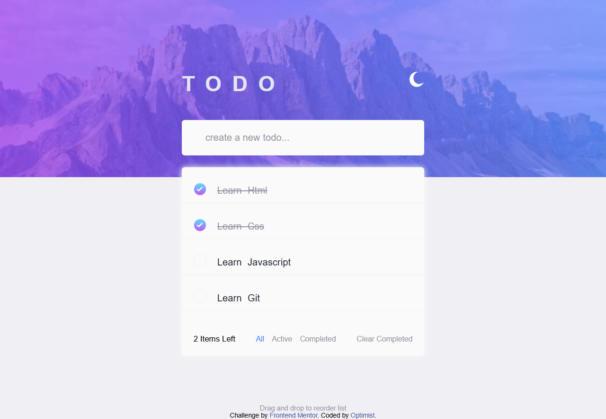

# Frontend Mentor - Todo app solution

This is a solution to the [Todo app challenge on Frontend Mentor](https://www.frontendmentor.io/challenges/todo-app-Su1_KokOW). Frontend Mentor challenges help you improve your coding skills by building realistic projects.

## Table of contents

- [Overview](#overview)
  - [The challenge](#the-challenge)
  - [Screenshot](#screenshot)
  - [Links](#links)
- [My process](#my-process)
  - [Built with](#built-with)
  - [What I learned](#what-i-learned)
  - [Continued development](#continued-development)
  - [Useful resources](#useful-resources)
- [Author](#author)
- [Acknowledgments](#acknowledgments)

## Overview

Thanks for checking out this front-end coding challenge. In this challenge, I build out this todo app and get it looking as close to the design of front-end coding challenge possible.

### The challenge

Users should be able to:

- View the optimal layout for the app depending on their device's screen size
- See hover states for all interactive elements on the page
- Add new todos to the list
- Mark todos as complete
- Delete todos from the list
- Filter by all/active/complete todos
- Clear all completed todos
- Toggle light and dark mode
- **Bonus**: Drag and drop to reorder items on the list

### Screenshot





### Links

- Solution URL: (https://github.com/optimist001/Frontend-Mentor-Todo-app)
- Live Site URL: (https://frontend-mentor-todoapp-optimist.netlify.app/)

## My process

### Built with

- Semantic HTML5 markup
- CSS custom properties
- Flexbox
- CSS Grid
- Desktop design-first workflow
- Vanilla Javascript

### What I learned

While working on this app, I learned how to create variables for body dark mode so that when i toggle to dark mode, every elements that need to change color changed automatically without adding new comdition for them on toggle.

I also learned how to save file to local storage so that the items will not dissappear on reload.

I also learn to write function that update items left, however, the function is not able to track the items left automatically unless i reload the page - which is a bug.

```css
/* === dark mode color variables */
body.darkmode {
  background-image: url(/images/bg-desktop-dark.jpg);
  --accent-color: hsl(240, 4%, 75%);
  --Very-Dark-Desaturated-Blue: hsl(235, 24%, 19%);
  --primary-color: hsl(235, 21%, 11%);
  --secondary-color: hsl(233, 14%, 35%);
  --text-color: hsl(236, 33%, 92%);
  --Dark-Grayish-Blue: hsl(234, 11%, 52%);
  --bg-color: hsl(237, 14%, 26%);
}
```

```js
// update item left counter
function updateItemsLeft() {
  const activeTodos = todos.filter((todo) => !todo.completed).length;
  itemsLeft.textContent = `${activeTodos} item${
    activeTodos !== 1 ? "s" : ""
  } left`;
}
```

### Continued development

While I have written more reasonable codes that broadened my mind with this project, I still have a lot of section that I need further study and help.

In this project, I need help on how to make the updateItemsLeft more functional - I want it to display items left immediately I add new item, delete existing and or toggle complete on lists.

Also I need help on how to create a working function for filter buttons (all/active/completed) - so that it will display each items that belong to respective button onclick.

Finally, I want to clear only completed items but with the function that I created for the button, it clears everything inside the todo list.

See the function below:

```js
function renderTodos() {
  listContainer.textContent = "";

  // todos.forEach((todo, index) => {
  //     const listItem = document.createElement('li')
  //     listItem.innerText = todoText;
  //     listContainer.appendChild(listItem);
  // })
  addTodos();
  saveTodo();
  updateItemsLeft();
}
```

The above function is the function that I called when I click the clear complete button.

So with this app Users will not be able to:

- Filter by all/active/complete todos
- Clear all completed todos
- **Bonus**: Drag and drop to reorder items on the list

### Useful resources

- (https://www.youtube.com/@webdev) - This helped me with the understanding of local storage to save items locally. I really liked this pattern and will use it going forward.

## Author

- Linkedin - [optimist](https://www.linkedin.com/in/tiamiyu-ibraheem/)
- Frontend Mentor - [@optimist001](https://www.frontendmentor.io/profile/optimist001)
- Twitter - [@OlakitanIbrahe2](https://x.com/OlakitanIbrahe2)

## Acknowledgments

I acknowledged the author of Web Dev youtube channel.
